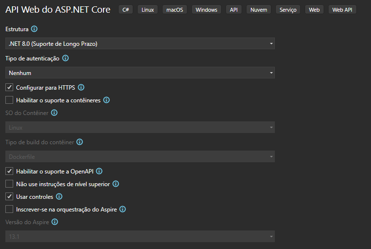
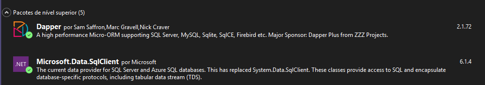
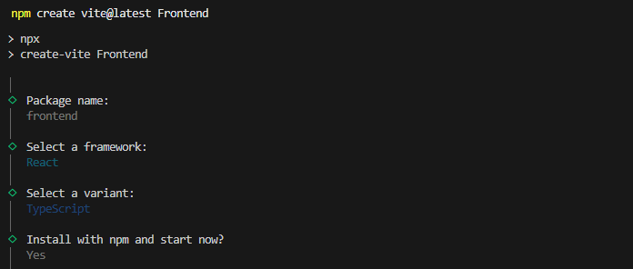

# Controle de Gastos Residenciais
Projeto para implementação de um **sistema de controle de gastos residenciais**. O sistema desenvolvido em formato FullStack para o controle eficiente de despesas domésticas, utilizando **API REST** no back-end e **React + Typescript** no front-end.

## Tecnologias Utilizadas

### Back-end
- C# com .NET (WebAPI REST)
### Front-end
- React com TypeScript
### Banco de dados
- SQL Server

---

## Instalação
Para executar o projeto são necessários as seguintes ferramentas:

### Visual Studio
Baixe o **VS** no site da Microsoft: 
    [link](https://visualstudio.microsoft.com/pt-br/)
Após o download instale o **VS** com a seguinte carga de trabalho:
- Desenvolvimento para desktop com .NET

### SQL Server Management Studio (SSMS)
Baixe e instale o **SSMS** através do site da Microsoft: 
    [link](https://learn.microsoft.com/en-us/ssms/install/install)
Ele utilizará o Visual Studio Installer para concluir a instalção

### Visual Studio Code
Baixe e instale o **VSCode** pelo site: 
    [link](https://code.visualstudio.com/) 

---

## Banco de Dados
Após a instalação do SSMS certifique que está tudo correto e começamos a executar os seguintes comandos:
- Pessoas:
```sql
CREATE TABLE Pessoas (
    Id INT IDENTITY(1,1) PRIMARY KEY,
    Nome NVARCHAR(200) NOT NULL,
    Idade INT NOT NULL,
    DataCadastro DATETIME NOT NULL
);
```
- Categorias:
```sql
CREATE TABLE Categorias (
    Id INT IDENTITY(1,1) PRIMARY KEY,
    Descricao NVARCHAR(400) NOT NULL,
    Finalidade VARCHAR(10) NOT NULL,
    CHECK (Finalidade IN ('Despesa', 'Receita', 'Ambas')),
    DataCadastro DATETIME NOT NULL
);
```
- Transações
```sql
CREATE TABLE Transacoes (
    Id INT IDENTITY(1,1) PRIMARY KEY,
    Descricao NVARCHAR(400) NOT NULL,
    Valor DECIMAL(10,2) NOT NULL,
    Tipo NVARCHAR(10) NOT NULL CHECK (Tipo IN ('Despesa', 'Receita')),
    IdCategoria INT NOT NULL,
    IdPessoa INT NOT NULL,
    DataCadastro DATETIME NOT NULL
);
```
Aqui temos o ID como chave primaria e autoincremental sem a possibilidade para alteração. Para desenvolvimento recomendo a não inclusão da chave estrangeira, mas após colocado em produção é recomendado colocar chaves estrangeiras para proteger as tabelas, recomendo essa dus para transação:
```sql
CONSTRAINT FK_Transacao_Pessoa
    FOREIGN KEY (IdPessoa)
        REFERENCES CadastroPessoas(Id)
        ON DELETE CASCADE,

CONSTRAINT FK_Transacao_Categoria
    FOREIGN KEY (IdCategoria)
    REFERENCES CadastroCategorias(Id)
```

---

## Backend (API C#)
Crie um novo projeto utilizando o modelo
- API Web do ASP.NET Core C#
Defina um nome e aplicamos o .NET a versão que quiser. Eu escolhi montar na versão .NET 8.0



Após isso vamos separar o projeto em 3 pastas distintas utilizando a lógica de **separação de responsabilidade**.
Isso facilita:
- manutenção do código;
- escalabilidade do sistema
- organização da aplicação

A pasta de **Models**, que representam os dados do sistema, como eles são estruturados dentro do BD. A pasta de **Service**, que contém a lógica do sistema e a comunicação com o BD. E a pasta **Controller** que contém os endpoints da API, isso é, onde recebe as requisições HTTP. Ficando com o seguinte fluxo:
```
Controller
        │
        ▼
Service
        │
        ▼
Banco de dados
```

Para o projeto instalamos os seguintes pacotes do NuGet:



- O Microsoft.Data.SqlClient realiza a conexão, executa comandos e lê resultados do SQL.
- O pacote Dapper transforma os resultados do SQL em objetos C# automaticamente.

> Dentro do codigo contém comentarios explicando os campos.

---

## Frontend (React + TypeScript)
Abra o **VSCode** e verifique se está instalado o Node.js e se a versão está igual ou superior a v20. Execute o comando ```node -v``` e se retornar tudo certo para continuar, se não instale o Node.js e o npm.

Após a instalação execute o seguinte comando para criar o React ```npm create vite@latest NOME_PASTA```, defina um nome do package (por padrão deixar o mesmo da pasta), escolha o framework React, com variant Typescript e selecione 'Yes'.



Após isso execute os seguintes comandos para instalar os pacotes para utilizar no projeto

```powershell
npm install
npm install react-router-dom
npm install react-icons
npm install axios
```
- react-router-dom (Pacote de rotas)
- react-icons      (Pacote de icones)
- axios            (Instalar AXIOS para conexão com a API)

Após isso você estará pronto para iniciar o projeto e fazer as páginas e conexões com a API necessarias para realizar testes ou colocar em produção.

---

## Executando o Projeto
Para executar este projeto em desenvolvimento primeiro deve-se criar o banco de dados no servidor de sua preferencia e alterar a linha dentro da API onde aponta os dados para conexão com o BD:

```json
"Db": "Server=SERVIDOR;Database=BANCO_DADOS;Integrated Security=True;TrustServerCertificate=True;MultipleActiveResultSets=True;"
```
Após isso iniciar a API em localhost (o localhost pode mudar máquina para máquina, altere para o valor que aparecer para você. Nesse projeto o localhost da API ficou como 'localhost:7099'). Teste a conexão com o banco de dados que foi criado e verifique se está tudo de acordo e não esteja retornando código 500.

E por último executar o react com o comando ```npm run dev``` e se tudo estiver correto a tela inicial aparecerá para você poderá ver o projeto em execução correta.

---

## Estrutura do Projeto
```
ControleGastos
│
├── Backend
│   ├── Controllers
│   ├── Models
│   ├── Services
│   └── Program.cs
│   
│
├── Frontend
│   ├── src
│   │   ├── components
│   │   ├── pages
│   │   ├── styles
│   │   └── App.tsx
│
└── README.md
```